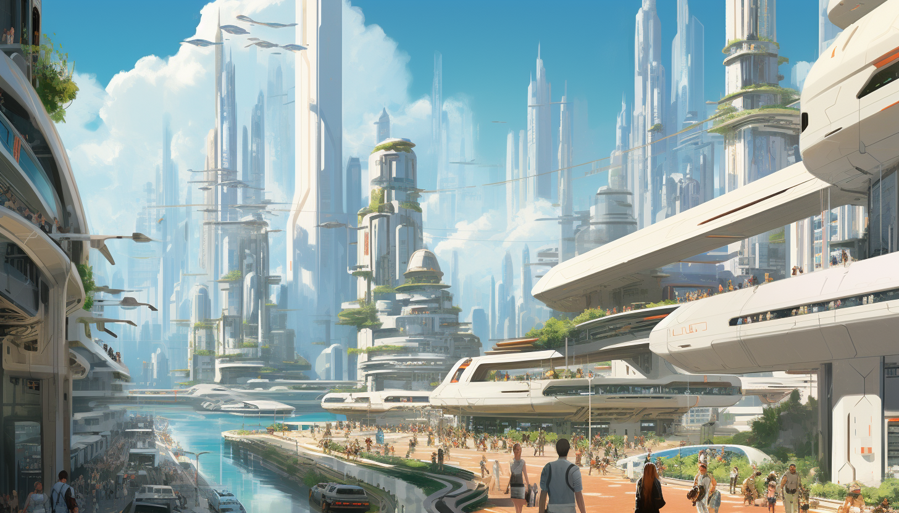

You always wanted to start a personal blog? Make a website portfolio and start posting tech articles?

I got you covered 😉! Now I will unveil you main problems that you are going to face and tell you about mine experience.

In short I am going to explain how I created this blog which you are currently reading. Btw check the source code [here](https://github.com/vguleaev/vguleaev.dev).

Lets start! 🚀

## Tech Stack

I strongly recommend everyone who is making a blog to use Astro. [Astro](https://astro.build/) is a web framework for this use case. Astro by default ships no Javascript and all pages are static (prerendered at build time). This gives us massive performance! 💪

Next tech is [Tailwind](https://tailwindcss.com/). There is a lot of hate and love about Tailwind CSS. My personal opinion is its very good to go fast. Once you know utility classes you completely skip writing css files which actually saves a lot of time. Try it.

Last piece if hosting. You can go with [Netlify](https://www.netlify.com/) but I personally prefer [Vercel](https://vercel.com/). Simply because I have other projects there which a mostly Nextjs 😅. Vercel anyway is a good choice because is a decent hosting and also has Astro zero config option + different integrations like Analytics, Image Optimization etc.

## Where to start?

I recommend you first go through <strong>tutorial</strong> on official Astro website. Just trust me its great. I only finished this tutorial and next day just made this blog. It explains everything you need. Link below:

https://docs.astro.build/en/tutorial/0-introduction/

Finish this tutorial completely I made it in one day. Then also go for next part called <strong>"Extend with Content Collections"</strong> and then to third part <strong>"Extend with View Transitions"</strong>. Don't worry they are quite small!

In this tutorial you will learn basics about Astro and how to create a functional blog, write articles in .md files and even theme toggle.

In this tutorial they will use Netlify as hosting but you can also just use Vercel.

## Styling

After you complete the tutorial blog will be quite ugly let's be honest here. 😃 I can't help you with styling much since its a personal prefference but I can recommend you to use <strong>any</strong> Tailwind framework. I used [Preline](https://preline.co/).

Installation of Tailwind and Preline worked like a breeze for me! 🌟

You can choose anything you like, just go Components page and grab some header, then grab some footer, then grab some grid with cards and you pretty much done with the blog.

Tailwind also supports <strong>dark theme</strong> by default. It adds class to your `html` for dark and light theme. So implementing a theme toggle is just a 5 minute copy paste.

Be careful with Javascript it's not shipped to Astro components and pages by default. Luckily Astro has tons of plugins and adapters. Just go to Framework Integrations page and see if Astro is available there.

## Hosting

Astro is not SPA but MPA. This means you dont have any Javascript framework like React that is doing client side routing and navigation.

Every page in Astro is full refresh by clicking `<a>` tags. I reommend to go with Vercel as hosting because it has zero config deployments for Astro projects and supports most of Astro modes static, serverless, and SSR.

Vercel has a very nice free tier which is good for blog in the beginning, because you site is static it should be very cheap in future also.

If you go with Vercel hosting I reommend you to include this stuff in your `astro.config.js`

```javascript
import { defineConfig } from 'astro/config';
import sitemap from '@astrojs/sitemap';
import tailwind from '@astrojs/tailwind';
import vercel from '@astrojs/vercel/static';

export default defineConfig({
  site: 'https://yoursite.com',
  integrations: [sitemap(), tailwind()],
  output: 'static',
  adapter: vercel({
    webAnalytics: {
      enabled: true,
    },
    speedInsights: {
      enabled: true,
    },
  }),
  redirects: {
    '/blog': '/',
  },
});
```

This enables Analytics in Vercel and SpeedInsights, since these features are free I think its no brain to grab them.

One more thing here, the redirects part didnt work for me, at least it worked locally but not when I deployed it on Vercel. So here i had to make a trick. I added `vercel.json` file and added rewrites there:

```json
{
  "rewrites": [{ "source": "/blog", "destination": "/" }]
}
```

## Blog Posts

Your blog is ready and deployed 🥳! But its missing come content probably. Before you start creating those `.md` files I need to tell you something.

Astro will tranform md files to html. That means a text block im .md file will be transformed to `<p>`. This is of course not style and will look ugly. You will need to style those tags in some `globals.css` file but be careful so they don't leak to the rest of the app!

This is part of how I did it:

```css
.prose > p {
  // some styles
}

.prose > h1 {
  // some styles
}

.prose > h2 {
  // some styles
}
```

I added a class `.prose` to my blog page layout and rendered content of `.md` inside it.

## Images

You can put all the images under `/public` folder but then you lose a possibility to use <strong>Image Optimization</strong> from Astro. Which is also supported on Vercel!

I highly recommend to use Image Optimization and store all the blog post covers in `/src` folder. You can read more how to setup it [here](https://docs.astro.build/en/guides/images/).

Just dont forget ot install `sharp` in dev dependency or it will fail during deploy on Vercel 😁.

Bonus tip:

I used [Midjourney](https://www.midjourney.com/) to generate my images so they look cool and I am free to use them without copyright. Midjourney is one of those fancy generative AI tools to create images from your text prompts.

Here is some prompt to Midjourney when I generated this post cover

```
A futuristic cityscape with towering skyscrapers, flying
vehicles, and a diverse population of humans and robots,
painted in a concept art style inspired by Syd Mead, with a
focus on detail and realism. --ar 7:4
```



Note that in the end I put `--ar 7:4`? This is to set aspect ratio of image to make it wider. You of course can make image full square and don't do this.

You can read more about aspect ratio [here](https://docs.midjourney.com/docs/aspect-ratios).

## Final touch

Now it's time to make our own brand most visible. We should add a favicon 🔥!

Here I went a very simple way and just generated a favicon of one Letter (first letter in my name). Here you can do it very easy:

https://favicon.io/favicon-generator/

Aaaand last thing is Domain name. Purchase Domain name from any Registrator, I chose [GoDaddy](https://www.godaddy.com/).

Then go to Vercel -> Project -> Settings -> Domains and look yours A and CNAME records there.

Congratulations you have professional blog now! Enjoy writing! 🎉🎉🎉
