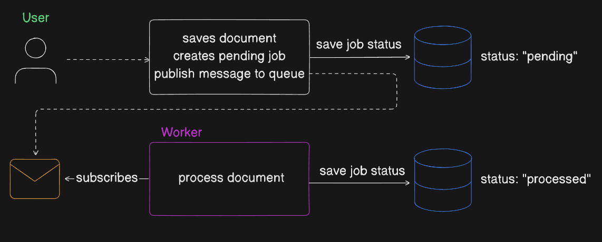

Over the years, I’ve seen many times when developers decide to use the database itself as a **queue**.

At first glance, this may seem like a convenient and simple solution. 👍

Nothing complicated to set up, no need to introduce additional infrastructure. Just create a db table, insert "tasks" as rows, introduce process status, and run a cron job to check for unprocessed items.

But in practice, I realized that this approach often **leads to more problems** than it actually solves.

Let me explain why I always prefer proper message queue systems over queues implemented in databases.

## Using Wrong Tool to Solve the Problem

It makes sense to mention in the beginning, that probably everybody understands that databases are not designed to be message queues. And we have plenty of specialized tools for that purpose: RabbitMQ, Kafka, AWS SQS, etc.

The main reason is **performance**. Databases are optimized for data storage and retrieval, not for the high-throughput, low-latency operations that queues require. But this argument becomes valid only when you have a _significant load_ with a lot of messages.

In case your application does not have high load, should you then use database as a queue? 🤔

Let's explore this question and I will give you more reasons why this approach is problematic.

## Locking and Concurrency Issues

Another reason why database is not an efficient queue is because of **concurrency problems**. If your application is a distributed system with multiple workers processing tasks from the db queue, you will run into issues.

The problem in this scenario is that multiple workers will try to read and write to the same table concurrently. Fetching either already processed tasks or overwriting each other. So you will either make sure only one worker always works at a time, or you will have to deal with implementing some locking mechanisms. 🔒

This also defeats the purpose of having multiple workers in the first place. You can not reduce processing time and scale workers anymore. 🐌

Additionally, polling overhead from cron job, updating tasks status and locking can lead to some load to database, which could be easily avoided by using proper queue.

## Out of the Box Features

Dedicated message queue systems come with a many features that are specifically designed to handle queuing use cases. These include:

- **Message Acknowledgment**: Ensures that messages are processed successfully before being removed from the queue.
- **Retry and Backoff Mechanisms**: Automatically retries failed messages with increasing delays.
- **Dead Letter Queues**: Captures messages that cannot be processed after a certain number of attempts, allowing for later analysis and reprocessing.
- **Scalability**: Easily scales horizontally by adding more workers.

In other words, implementing a queue in a database often requires building these features from scratch and you end up **reinventing the wheel**. This not only increases development time but also introduces potential bugs and maintenance challenges.

## Unnecessary Delay

Using a database as a queue often introduces **unnecessary delays** in message processing. Since most database queues rely on polling mechanisms (e.g., cron jobs) to check for new tasks, there is a fixed delay between when a task is added to the queue and when it is processed.

Let's say your cron job runs every minute. ⏳ Even if there is no requirement from business side how fast task must be processed, you still have to wait for the next cron job execution.

This happens for absolutely no reason 😅. Why does this 1 minute delay even exist? Did anybody ask for it? This delay is artificial because of the technical implementation choice.

## Comparing Pros and Cons

Now let's summarize the pros and cons of both approaches:

**Database + Scheduler Jobs**:

- ✅ simple and easy to implement
- ✅ no additional infrastructure required
- ✅ visibility is built-in (easy to query and see status of tasks)
- ❌ has performance bottlenecks
- ❌ concurrency issues with multiple workers
- ❌ lack of built-in features
- ❌ latency due to polling (cron jobs)

**Message Queues**:

- ✅ designed for high throughput and low latency
- ✅ built-in features like retries, dead letter queues, and message acknowledgment
- ✅ easily scalable with multiple workers
- ❌ requires additional infrastructure
- ❌ out-of-the-box visibility isn’t as nice as a SQL table

As we can see from this comparison message queues are very attractive in case you already have infrastructure for them set up.

The only part where message queues fall short is visibility of tasks and their status.

It is very convenient to simply run the query `SELECT * FROM jobs` and see how many tasks are `"pending"`, `"processed"` and `"failed"`.

This desire to track progress is important but can still be achieved with messages queues by implementing **hybrid approach**. This is what you will see in most applications in production.

## Hybrid Approach (Best of Both Worlds)

Hybrid approach is what I would like recommend in most case 👍. What many applications do is to use message queues for processing tasks but also log the status of each task in the database.

Imagine a scenario where user uploads a document for some background processing. You can imagine the following flow:

Our application will insert job record in the database with status `"pending"`. Then we push the task to the message queue for processing. A worker is subscribed to the queue and will pick up the task to process it. Then it will update the status in the database accordingly.

This approach uses full power of message queues while still providing **visibility** into task status through the database. You can build a nice dashboard by just querying job records from the database and see how many tasks are `"pending"`, `"processed"`, or `"failed"`. You can latter reprocess failed tasks by pushing them back to the message queue.

## Final

I hope this article helped you to understand why you should think twice before implementing queues in the database in your next project.

If you have any questions or want to discuss your experiences with queues in databases, feel free to reach out! And happy coding! 😃
