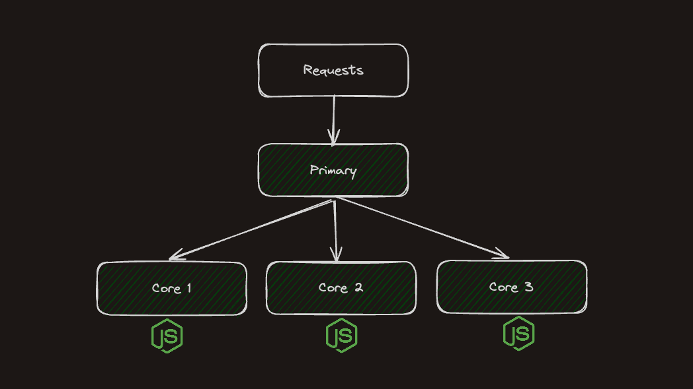

_Name of the post was inspired by a popular Javascript book called "You don't know JS"_ .

Nodejs is more than you think, I will try to prove this point and tell about modules of Nodejs that you probably didn't know about.

Let's begin!

## Event Loop

Even though everybody knows about event loop, not so many people know that it's actually a part of Nodejs runtime. Not a part of Javascript and not even a part of V8 engine, but a part of Nodejs. It heavily relies on [libuv](https://libuv.org/) library written in C for non-blocking asynchronous operations. At the same time browsers like Chrome also have event loop, but it's actually a different implementation.

I'm not going to talk about event loop in this article, however it was impossible not to mention it here.

## Event Emitter

We will start with a bit easier concept **Event Emitter**. This class is a fundamental part of Node.js's asynchronous event-driven architecture.

Node.js Event Emitter is used to implement [pub-sub pattern](https://en.wikipedia.org/wiki/Publish%E2%80%93subscribe_pattern). The idea is very simple:
emitter is a publisher which emits **named events** and callback functions are registered as subscribers.

You can create instance of `EventEmitter` or inherit from it to create your own class.

```javascript
import { EventEmitter } from 'events';

const eventEmitter = new EventEmitter();
```

You are probably familiar with events by using Javascript in the browser: mouse click, input on change and so on. EventEmitter class has two mains functions
`emit` and `on`.

- `emit` is used to trigger the event
- `on` is to register event listener function

```javascript
import { EventEmitter } from 'events';

const eventEmitter = new EventEmitter();

eventEmitter.on('sendMessage', (message) => {
  console.log(message);
});

eventEmitter.emit('sendMessage', 'Hello Nodejs');
```

When you emit an event you must give it a name. Name of event is used to register listener. You can also send some data together with an event as arguments.

> If you change order of `emit` and `on` then you will not see a console log. This is because events are executed synchronous. Please consider using async functions for callback in case you need.

There can be multiple listeners to the same event. Event callbacks will be executed in the order they were registered.

```javascript
eventEmitter.on('event', () => console.log(1));
eventEmitter.on('event', () => console.log(2));
eventEmitter.on('event', () => console.log(3));

eventEmitter.emit('event'); // 1 2 3
```

You can also remove listeners by calling functions like `removeListener()` and `removeAllListeners()`.

## Buffer

Buffer is used to store and manipulate **binary data** in Nodejs. Buffer class is inherited from `Uint8Array` and is internally represented as fixed sequence of bytes.

What is binary data?

Examples of binary data are images, files, audio, video and raw data from a network.

You can create buffer and select its size using `alloc()` function. By default buffer is filled with zeros. This how you can create 3 bytes buffer.

```javascript
import { Buffer } from 'buffer';

const buffer = new Buffer.alloc(3);

buffer[0] = 0;
buffer[1] = 1;
buffer[2] = 256;

console.log(buffer); // <Buffer 00 01 00>
```

> Please note that since it's a byte array, values can be only in range 0 - 255. For value 256 we get 0 because it's a byte overflow.

Buffers can be created from string, byte array or another buffer. You can also specify buffer encoding.

```javascript
const buffer = Buffer.from('hello', 'utf8');

console.log(buffer); // <Buffer 68 65 6c 6c 6f>
console.log(buffer.byteLength); // 5

console.log(buffer.toString('utf8')); // hello
console.log(buffer.toString('hex')); // 68656c6c6f
```

In this example buffer is created from string `"hello"`. Every char in a string is 1 byte, so our buffer should have 5 bytes size. When you console log buffer it shows every byte in hexadecimal notation, but you can call `toString()` and specify the encoding.

To prove that `Buffer` is actually an array of bytes you can iterate over it with simple for loop.

```javascript
const buffer = Buffer.from('hello');

for (const b of buffer) {
  console.log(b); // 104 101 108 108 111
}
```

> Bytes are printed in decimal notation here

## Stream

Streams in Node.js are used for processing data in chunks, piece by piece in a sequential way. They can be readable, writable and both (duplex).

You can create new instances of Readable and Writable streams, however it is usually not necessary to import `stream` module to use them.

```javascript
import { Readable } from 'stream';

const readableStream = Readable.from('hello streams');

readableStream.on('data', (chunk) => {
  console.log(chunk); // hello streams
});
```

A common use case for stream is reading or writing large amount of data. If you read a big file all at once it will be fully loaded in memory. However with a stream you can read file in chunks and save memory.

Let's assume we have a file called `file.txt` which contains just one line `hello`. This is an example of reading file using **readable stream**.

```javascript
import fs from 'fs';

// chunk size is 1 byte
const readStream = fs.createReadStream('file.txt', { highWaterMark: 1 });

readStream.on('data', (chunk) => {
  console.log(chunk.toString()); // h e l l o
});
```

> `highWaterMark` param is optional, default value is 64 kb. In this example I wanted to read 1 letter at time. Because we know that 1 letter equals 1 byte we can define size of chunk as 1 byte.

You can notice that streams are actually instances of `EventEmitter`. It processes a chunk of data and emits an event called `data`.

Chunks values are actually of type `Buffer`. In this example chunk buffers have 1 byte size. This is why we need to call `toString()` to see one letter per console log.

Now let's create a file using **writable stream**.

```javascript
const writeStream = fs.createWriteStream('example.txt');

writeStream.write('hello ');
writeStream.write('world');
writeStream.end();
```

This should create a file called `example.txt` in current directory with content `hello world`. We can call `write()` function multiple time to push chunks of data to the writing stream and then finish stream by calling `end()` function.

Classic examples of writable streams include: `http.ServerResponse`, `fs.createWriteStream`, `zlib.createGzip()`, `process.stdout`.

## zlib

Module **zlib** in Node.js provides compression functionality using Gzip, Deflate/Inflate, and Brotli.

We use compression algorithms to reduce the amount of space needed for a file. Compression and decompression functions work with **Streams**.

Let's again assume we have a file called `file.txt` which contains just one line `hello` and we want to **compress** it. For this we can use `createGzip()` function to create a gzip transformer and use it in stream `pipeline`.

```javascript
import { createGzip } from 'zlib';
import { pipeline } from 'stream';
import { createReadStream, createWriteStream } from 'fs';

const gzip = createGzip();
const source = createReadStream('file.txt');
const destination = createWriteStream('file.txt.gz');

pipeline(source, gzip, destination, (err) => {
  if (err) {
    console.error('Compression failed', err);
  } else {
    console.log(`Compression successful!`);
  }
});
```

As I mentioned before `zlib` module mostly works with streams. Function `createGzip()` returns a **TransformStream** (_or ReadWriteStream_).

This stream is basically a transformer between input and output data. Then we need `pipeline()` function from `stream` module to be able to create a chain of streams. We can pass to this function our read, transform and write streams. Of course order of arguments is important here 😄!

Pipeline will process data in chunks, where every chunk will be read, compressed and then written to file. After running this code you should have gzip file created with name `file.txt.gz`.

Now let's have a look at the exactly opposite example. We want to read gziped file and extract its original content. This can be done very easy by again using `pipeline` but this time use gunzip transform from `createGunzip`.

```javascript
import { createGunzip } from 'zlib';
import { pipeline } from 'stream/promises';
import { createReadStream, createWriteStream } from 'fs';

const gunzip = createGunzip();
const read = createReadStream('file.txt.gz');
const write = createWriteStream('file-gziped.txt');

await pipeline(read, gunzip, write);
```

> Here I used promisified version of `pipline` which works with async/await. Most of modern Node.js modules has promisified versions which converts callback-based methods to promise-based e.g `fs/promises`.

After running this code you should have a file `file-gziped.txt` with its original content.

## crypto

The `crypto` module provides cryptographic functions useful for creating hashes, signing, verifying, encrypting and decrypting data.

For example we can easily create a **sha256** hash from a string by using `createHash()`.

```javascript
import crypto from 'crypto';

const hash = crypto.createHash('sha256');
hash.update('hello world');
const output = hash.digest('hex');
console.log(output); // b94d27b9934d3e08a52e52d7da7dabfac484efe37a5380ee9088f7ace2efcde9
```

> I know it may look confusing but by cryptographic rules we must create a hash object first, then `update()` it with our content and then call `digest()` to produce an output in specified encoding.

Another useful function from this module is `randomBytes()`. This function will produce a `Buffer` of cryptographically secure random bytes of given length.

```javascript
import crypto from 'crypto';

const buffer = crypto.randomBytes(16);
console.log(buffer.toString('hex')); // random 16 bytes hexadecimal string
```

More common use case for `crypto` module is actually encrypting data.

A popular example of encrypting/decrypting data usually uses an [aes-256-cbc](https://en.wikipedia.org/wiki/Advanced_Encryption_Standard) algorithm. This is a very secure symmetric algorithm, meaning the same key is used for both encrypting and decrypting the data.

```javascript
import crypto from 'crypto';

const algorithm = 'aes-256-cbc';
const password = 'pass';
const salt = crypto.randomBytes(16);
const key = crypto.scryptSync(password, salt, 32);
const iv = crypto.randomBytes(16);

const cipher = crypto.createCipheriv(algorithm, key, iv);
const encrypted = cipher.update('hello world', 'utf8', 'hex') + cipher.final('hex');
console.log(encrypted); // 94366f8f470486f2477c7f0908a55e9f
```

In this example I encrypt `"hello world"` string using `aes-256-cbc` algorithm. For this we will need to create cipher by calling `createCipheriv()` function and two things **key** and **iv**. Both are of type `Buffer`.

They need to be as much random as possible to prevent hacking attempts. Iv is an [Initialization vector](https://en.wikipedia.org/wiki/Initialization_vector) and must be specific length. Note that AES-256 uses a 256 bits length key (32 bytes) and 128 bits iv (16 bytes).

To decrypt string we can perform a very similar operation, but this time using decipher from `createDecipheriv()` function.

```javascript
const decipher = crypto.createDecipheriv(algorithm, key, iv);
const decrypted = decipher.update(encrypted, 'hex', 'utf8') + decipher.final('utf8');
console.log(decrypted); // hello world
```

> You must use the **same** key and iv to decrypt data back.

## http

The `http` module in Node.js is needed to transfer data over the **Hyper Text Transfer Protocol** (HTTP). It allows to make http requests in Node.js as well as create your own HTTP servers.

This example creates a very basic HTTP server that listens to port 8080. For any request it will just return `hello world` string. Pretty simple, right 😃?

```javascript
import http from 'http';

const server = http
  .createServer((req, res) => {
    res.write('hello world');
    res.end();
  })
  .listen(8080);
```

> Open http://localhost:8080 in browser to see "hello world" response.

This probably looks familiar to you if you used before any Javascript backend framework like _express.js_ or _fastify_. They of course use `http` module under the hood and simplify a lot of stuff for us, because dealing with raw http requests is not easy.

**req** argument represents http request and is instance of a class `http.IncomingMessage` which is a subclass of `ReadableStream`.

**res** argument represents http response and is instance of a class `http.ServerResponse` which is a subclass of `WritableStream`.

We can send status code and response headers by using `res.writeHead()` function. This means our http server suppose to return JSON content back.

```javascript
res.writeHead(200, { 'Content-Type': 'application/json' });
```

Let's create more real world endpoint for our server. We will implement GET `/hello` endpoint and return some JSON data.

For this we need to check for request's url and method, set proper header, create a response object and write it to response stream as a string.

```javascript
const server = http
  .createServer((req, res) => {
    if (req.url === '/hello' && req.method === 'GET') {
      const response = {
        message: 'Hello, World!',
      };
      res.writeHead(200, { 'Content-Type': 'application/json' });
      res.write(JSON.stringify(response));
      res.end();
    }
  })
  .listen(8080);
```

> If you try to access any other endpoint, our server will hang. This is because we only call `res.end()` for `/hello` GET endpoint.

We can go further and have a look at example of reading POST request body. Let's implement POST `/hello` endpoint that simply reads request body and logs it to console.
Even though it sounds very simple, but in reality it requires quite some operations.

We know that request is `EventEmitter` which emits event called **data** with chunks of request body. We have to make sure we read it fully and for this we need another event called **end**. Then we can simply concatenate chunks of data until **end** event is fired to get full request body.

```javascript
const server = http
  .createServer((req, res) => {
    if (req.url === '/hello' && req.method === 'POST') {
      let body = '';

      req.on('data', (chunk) => {
        body += chunk;
      });

      req.on('end', () => {
        console.log(body);
        res.end();
      });
    }
  })
  .listen(8080);
```

## https

The `https` module in Node.js is needed to transfer data over HTTP TLS/SSL protocol, which is the secure HTTP protocol. Yes, https in Node.js is implemented in a separate module.

This time we will not create a server, but instead make a http request. To make http request in Node.js you need to use method `https.request()` which returns back request object and accepts a callback function to process the response.

Here I will simply make a request to www.google.com and print to console HTML content of the google search page.

```javascript
import https from 'https';

const options = {
  hostname: 'www.google.com',
  port: 443,
  path: '/',
  method: 'GET',
};

const req = https.request(options, (res) => {
  let data = '';

  res.on('data', (chunk) => {
    data += chunk;
  });

  res.on('end', async () => {
    console.log(data);
  });
});

req.on('error', (error) => {
  console.error(error);
});

req.end();
```

> Port 443 is the standard port for HTTPS.

The `options` object is used to specify details about the HTTP request, such as the hostname, port, path, and method. In our response callback function you can notice a similar pattern we already used before. Again we get a response stream and listen to **data** event until stream is finished. We can also handle error cases by adding a callback function for **error** event.

## net

The `net` module in Node.js provides functionality to create **TCP or IPC** servers and clients.

How different is TCP server from HTTP? Well you probably know that HTTP utilizes TCP to transport data. TCP is transport layer protocol, while HTTP is application layer protocol. You can say that HTTP is more high level protocol which uses TCP under the hood.

Main difference is that TCP is stateful and connection-oriented, meaning a connection between client and server is established before data can be sent.

HTTP is generally considered stateless because, after the client has established a connection with a server, sent a request, and received a response, the connection is immediately dropped.

Enough theory.. 😬 Let's create a basic TCP server and send some data to it.

```javascript
import net from 'net';

const server = net.createServer((socket) => {
  socket.write('Hello from TCP server!');

  socket.on('data', (data) => {
    console.log(data.toString());
  });

  socket.on('end', () => {
    console.log('Data transmission finished');
  });

  socket.on('close', () => {
    console.log('Client disconnected');
  });
});

server.listen(3000, () => {
  console.log('Server listening on port 3000');
});
```

Here I create new TCP server using `net.createServer()` function. The callback function is called when client connects to the server, this creates an object called `socket` which represents the client connection. `Socket` object implements `EventEmitter` API and has familiar to us events for reading data sent to our server. These events are **data** and **end**. We can read data with the same pattern, reading chunk of data which are of type `Buffer` or `String`.

To respond client you can simply call function `socket.write()`. `Socket` object is also a `WritableStream`.

To test this server you need to use something that can make TCP connections. Common terminal utilities for this are `netcat` or `telnet`, you maybe need to install them. This is the command to connect using **netcat**. You should be able to see welcome message right after connection.

```
> netcat localhost 3000
Hello from TCP server!
```

After connection is established you will see message `Hello from TCP server!` in terminal and then you can type any text and press enter to send data. You should be able to see data received and logged to the console on our server. Closing connection on client should result in seeing `'Client disconnected'` log on server.

## child_process

The `child_process` module provides functionality to create subprocesses in Node.js. Every Node.js application starts as a single process in your operating system and runs on a single thread (main thread).

What is a thread? A thread is the subset of a process and is also known as the lightweight process. A process can have multiple threads.

`child_process` module is used to spawn new processes, which can be called **child processes**. This module contains four main functions:

- `spawn()`
- `fork()`
- `exec()`
- `execFile()`

Each of these methods returns [ChildProcess](https://nodejs.org/api/child_process.html#class-childprocess) instance which implements `EventEmitter` API.

These methods create processes asynchronously, but also have a synchronous versions: `execSync()`, `execFileSync()`, `spawnSync()`. They need to be used with caution, because they will block the Node.js event loop!

`spawn()` and `exec()` are used to execute **external** process.

`spawn()` is suitable for creating long-running processes or processes with a heavy output. Child process returned by it has `stdout` and `stderr` streams to return command output or errors.

In this example I use `spawn` to execute a simple `ls -la` command to show files in current directory.

```javascript
import { spawn } from 'child_process';

const child = spawn('ls', ['-la']);

child.stdout.on('data', (data) => {
  console.log(`output: ${data}`);
});

child.stderr.on('data', (data) => {
  console.error(`error: ${data}`);
});

child.on('close', (code) => {
  console.log(`child process exited with code: ${code}`);
});
```

I call `spawn` method and pass command as string and arguments in array of strings. This returns a `ChildProcess` instance, which has `stdout` and `stderr` properties, both of type `ReadableStream`. Streams implement `EventEmitter` API so we can listen to `data` events to see output of command or errors.

How different is `exec`?

`exec()` is designed to run smaller output processes and has a limit of **1 MB** of output data. Child processes returned by it again has `stdout` and `stderr` properties, but this time of type `String`!

Output default encoding is UTF-8. You can set encoding to `buffer` in options, then `Buffer` object will be returned as output.

In this example I use `exec` to execute a simple `ls -la` command.

```javascript
import { exec } from 'child_process';

const child = exec('ls -la', (error, stdout, stderr) => {
  if (error) {
    console.error(`process failed to start: ${error.message}`);
    return;
  }
  if (stderr) {
    console.error(`error: ${stderr}`);
    return;
  }
  console.log(`output: ${stdout}`);
});
```

> `exec()` by default spawns a shell, similar as you running commands in terminal, on the other hand `spawn()` is not doing it by default.

I call `exec` method and pass whole command as one string and a callback function which will run when process is finished. Callback function has three arguments: error, stdout and stderr to read process output and errors.

**Bonus**: because `exec` is not using streams but returns output at once within a callback function, we can turned it into promise based function using utility from Node.js `util.promisify()`. This makes it much more readable, have a look:

```javascript
import util from 'util';
import { exec } from 'child_process';
const execAsync = util.promisify(exec);

const { stdout, stderr } = await execAsync('ls -la');
console.log('stdout:', stdout);
console.error('stderr:', stderr);
```

🛑 Warning: `exec()` and `spawn()` are NOT designed for spawning Node.js processes!

For this case we should use `fork()`, because it allows **IPC communication** between parent and child processes by sending messages.

`fork()` is used to spin up a whole new Node.js process. It will have its own Node runtime with its own memory, V8 instance and its own event loop! Of crouse this should not be cheap in terms of memory usage and also not fast, because of context switching 🐌!

And don't get confused with meaning of word _fork_, it does NOT clone current process!

Let's assume we have two js files: `parent.js` and `child.js`. We will start child.js using `fork()` function. For simplicity we will send a value to child process and let child double the value, then send it back to parent.

```javascript
// parent.js
import { fork } from 'child_process';

const child = fork('./child.js');

child.on('message', (msg) => {
  console.log('Message from child: ', msg);
});

child.send({ value: 2 });

// child.js
process.on('message', (msg) => {
  console.log('Message from parent:', msg);

  process.send({ result: msg.value * 2 });
  process.exit();
});
```

This is the output of running this script.

```
> node parent.js
Message from parent: { value: 2 }
Message from child:  { result: 4 }
```

In this example I spawned completely new Node.js subprocess by executing `child.js` script. For this I called `fork()` function and passed path to a another js file. This again returns instance of `ChildProcess` but this time also establishes communication channel.

Yes, it must be a separate file, which will start a new Node.js program in **isolation**. This means sharing objects from main process memory is **not possible**!

The only way to communicate between parent and child is by IPC (inter-process communication) channel, meaning sending messages. Luckily they are serializable, so we dont need to parse strings (e.g I send number in this example and I dont need to cast it).

Parent process can send data to child by calling `child.send()` function and read messages by registering a callback to `child.on('message')` event.

Child process can receive message from parent by listening to `process.on('message')` event and respond to parent with `process.send()`.

> Parent program will not terminate until all spawned subprocesses are exited. So calling process.exit() is very important inside child. Alternatively parent can kill a child process by calling child.kill().

What is the use case of fork?

Well, parallel programming is the answer. It gives the ability to execute multiple Node.js applications at the same time, so in parallel. This can be useful when dealing with CPU heavy computation tasks like processing graphics, mathematical calculations, and video or image compression.

One common technique to achieve performance is splitting heavy tasks into smaller parts and let multiple cores to work on them at the same time.

Let's have a look at this example:

```javascript
console.time('time');

let counter = 0;

for (let i = 0; i < 3_000_000_000; i++) {
  counter = counter + 1;
}

console.log(counter.toLocaleString());
console.timeEnd('time');
```

This code just does 3 billion iterations and increases a counter. On my machine it takes around 3 seconds (depends on how powerful is your machine). How we can make it faster?

We split the task into 3 parts and calculate same number but in parallel. Each child process will do exact 1 billion iterations.

```javascript
// child.js
let counter = 0;
for (let i = 0; i < 1_000_000_000; i++) {
  counter = counter + 1;
}
process.send({ counter: counter });
process.exit();

// parent.js
import { fork } from 'child_process';

console.time('time');

let counter = 0;
const child1 = fork('child.js');
const child2 = fork('child.js');
const child3 = fork('child.js');

child1.on('message', (msg) => {
  counter += msg.counter;
});
child2.on('message', (msg) => {
  counter += msg.counter;
});
child3.on('message', (msg) => {
  counter += msg.counter;
});

const childrenPromises = [
  new Promise((resolve) => child1.on('exit', resolve)),
  new Promise((resolve) => child2.on('exit', resolve)),
  new Promise((resolve) => child3.on('exit', resolve)),
];
await Promise.all(childrenPromises);

console.log(counter.toLocaleString());
console.timeEnd('time');
```

Same 3 billion iterations are completed within 600 ms 😃! So much faster, because we could run them in parallel using advantage of multiple cores.

**Conclusion**: When choosing between `exec` and `spawn`, always chose `exec` when you expect smaller output or a CLI command, otherwise use `spawn`.
Use `fork` when you need to create a new Nodejs process in isolation or to achieve parallelism.

## cluster

The `cluster` module of Node.js allows to spawn multiple processes which share the **same server port** and handle incoming requests concurrently. This can help to distribute the workload of the requests and run each process on a separate CPU core making server more efficient.

Why do we need this?

Node.js handles perfectly I/O tasks in asynchrones way using just single process and single thread. When we build our http servers we want to them to process as much user requests as possible and be very performant. Sometimes things doesn't go so well and we have code that can block main event loop. When this happens our server is stuck and cant accept any more requests.



To demonstrate this, create a file `index.js` and start there http server with two endpoints one is fast and another is slow.
To make endpoint slow we will use loop with 3 billion iterations to imitate CPU heavy task.

```javascript
// index.js
import http from 'http';

http
  .createServer((req, res) => {
    if (req.url === '/slow') {
      let counter = 0;
      for (let i = 0; i < 3_000_000_000; i++) {
        counter = counter + 1;
      }
      res.end(`slow response: ${counter}`);
    }

    if (req.url === '/fast') {
      res.end('fast response');
    }
  })
  .listen(3000);

console.log(`Process ${process.pid} listening on port 3000`);
```

Slow endpoint request time is around 3 seconds and fast is less than 20 ms. ⌛

If you hit `/slow` endpoint first and then immediately hit `/fast`, you can notice that `/fast` is also hanging. This is because, slow endpoint **blocks Event Loop** and makes CPU busy, meaning http server cant handle any requests.

To avoid this we have two options:

- make sure we never do computational heavy tasks
- use `cluster` module

Cluster module allows us to create one primary node and as much workers nodes as you have cores available for parallelism. Cluster also acts like a load balancer and distributes requests across the workers in a round-robin fashion by default. All the workers are basically http servers which share the same port.

Now create another file `primary.js` with the following code:

```javascript
// primary.js
import cluster from 'cluster';
import os from 'os';

const cpuCount = os.cpus().length;

console.log(`The total number of CPUs is ${cpuCount}`);
console.log(`Primary pid=${process.pid}`);

cluster.setupPrimary({
  exec: './index.js',
});

for (let i = 0; i < cpuCount; i++) {
  cluster.fork();
}

cluster.on('exit', (worker, code, signal) => {
  console.log(`worker ${worker.process.pid} has been killed`);
  console.log('Starting another worker');
  cluster.fork();
});
```

Here we start the same `index.js` file with `/slow` and `/fast` endpoints in a cluster. Now if you hit `/slow` endpoint only event loop of one worker will be blocked and others will be available to serve requests.

This example starts as single process, which is identified as **primary** and creates several child processes (workers), one per each available CPU core. Number of workers can be different for you, depends on how many core your machine has.

Worker is basically an instance of Node.js created by `child_process.fork()` method. Each worker runs code from `index.js` file, which simply starts an http server. As a result we have multiple http servers that can serve requests in parallel sharing the same port. In case worker crashes, we can spawn a new one, this is done inside `exit` event callback.

If you run `primary.js` you should see similar output:

```
> node primary.js
Primary pid=58882
Process 58883 listening on port 3000
Process 58884 listening on port 3000
Process 58889 listening on port 3000
Process 58887 listening on port 3000
```

Workers are instances of class [Worker](https://nodejs.org/api/cluster.html#class-worker), because they are child processes they can talk to main process via IPC. Workers can send messages to parent in the same way as processes created by `fork()` method. Cluster has array of workers which can be accessed by id.

```javascript
// inside primary.js
for (const id in cluster.workers) {
  cluster.workers[id].on('message', ({ msg }) => {
    console.log('worker sent:', msg);
  });
}

// inside index.js
if (req.url === '/fast') {
  process.send({ msg: `processing on worker ${process.pid}` });
  res.end('fast response');
}
```

In modern architecture using `cluster` module is not popular, moreover it's limited by capacity of the machine you are using. When you want to scale **horizontally** its more common to add more nodes instead of using multiple core of one node. In case you still want to cluster Node.js application consider using [pm2](https://pm2.keymetrics.io/) package.

## worker_threads

It's time to talk about controversial topic in Node.js which is **multithreading** 😄!

The `worker_threads` module allows you to execute Javascript code in parallel using threads. Workers threads can be used for offloading CPU-intensive tasks, such as complex calculations, image resizing, or video compression.

💡 How is it different from cluster?

Each worker thread in Node.js has its own main loop, such as libuv. Similarly, each cloned Node.js process in clustering also has its own main loop.

Clustering is a technique used to distribute incoming requests to multiple copies of a Node.js server, allowing for load balancing.

Worker threads, on the other hand, allow a single Node.js process to delegate long-running functions to separate threads, preventing them from blocking the main loop.

Main difference from `child_process` or `cluster` is that worker threads **can share memory**. This can be done with help of `ArrayBuffer` and `SharedArrayBuffer` instances.

Because worker threads do not require allocation of extra memory, they are more lightweight than processes created with `fork()`. Threads are similar to processes and also run in parallel using multiple cores, but spawning too many threads won't be beneficial and can cause even slowdown of the system.

Now let's write code to imitate a CPU bound tak:

```javascript
console.time('time');

let counter = 0;

for (let i = 0; i < 3_000_000_000; i++) {
  counter = counter + 1;
}

console.log(counter.toLocaleString());
console.timeEnd('time');
```

We do 3 billion iterations in a loop, which takes on my machine around 3 seconds. We want to speedup this task and calculate same number with Workers. Each worker will do 1 billion of iterations and return result to main thread, then we sum results of workers.

First let's create a `worker.js` file.

```javascript
import { workerData, parentPort } from 'worker_threads';

let counter = 0;
for (let i = 0; i < 3_000_000_000 / workerData.numberOfWorkers; i++) {
  counter = counter + 1;
}

parentPort.postMessage(counter);
```

Worker thread can communicate with parent thread via messaging channel. `workerData` represents data sent to worker from parent and `parentPort.postMessage()` function is used to send data back to parent.

Now create `index.js` file and offload our CPU heavy task by spiting it among threads.

```javascript
import { Worker } from 'worker_threads';

const createWorker = (maxValue) =>
  new Promise((resolve, reject) => {
    const worker = new Worker('./worker.js', {
      workerData: { thread_count: THREAD_COUNT },
    });

    worker.on('message', (data) => {
      resolve(data);
    });
    worker.on('error', (error) => {
      console.error(error);
    });
  });

console.time('time');

const MAX_WORKERS = 3_000_000_000 / 1_000_000_000;
const workers = [];

for (let i = 0; i < MAX_WORKERS; i++) {
  workers.push(createWorker);
}

const results = await Promise.all(workers);
console.log(results.reduce((acc, val) => acc + val, 0).toLocaleString());

console.timeEnd('time');
```

To create a worker we need to create new `Worker` instance and pass file path. Additionally you can send data to worker using `workerData` param. In this example I send to worker max amount of threads so each worker can calculate only its part. `Worker` class implements `EventEmitter` API, meaning we should listen for events like `message` and `error`. To make code run in async manner we can create worker with `Promise` and resolve it when we got response from worker.

Then we create array of worker promises and wait for all of them to finish and calculate result value.

This code should complete the same task but much faster, for me it took round 600ms! Well done!

## Final

Huh, it was a long journey! You can find more info in [official documentation](https://nodejs.org/docs/latest/api/).

I hope you can feel now more confident using unpopular features of Node.js 😄!
